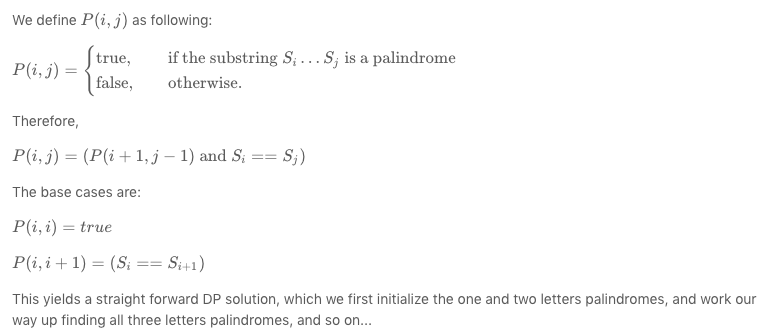

# Longest Palindromic Substring

## Problem

Longest Palindromic Substring

Given a string s, find the longest palindromic substring in s. You may assume that the maximum length of s is 1000.

## Solution

### Dynamic Programming



```go
package main

var (
    maxLen  = 1
    startAt = 0
    endAt   = 1
)

func main() {
    println(longestPalindrome("abba1"))
}

// Dynamic Programming
func longestPalindrome(s string) string {
    if len(s) < 2 {
        return s
    }

    runes := []rune(s)
    for i := range runes {
        extendPalindrome(runes, i, i)
        extendPalindrome(runes, i, i+1)
    }

    return string(runes[startAt:endAt])
}

func extendPalindrome(r []rune, j int, k int) {
    for j >= 0 && k < len(r) && r[j] == r[k] {
        j--
        k++
    }

    if k-j-1 > maxLen {
        maxLen = k - j - 1
        startAt = j + 1
        endAt = k
    }
}
```

### Manacher’s Algorithm

To calculate LPS array efficiently, we need to understand how LPS length for any position may relate to LPS length value of any previous already calculated position.

For string “abaaba”, we see following:


If we look around position 3:

* LPS length value at position 2 and position 4 are same
* LPS length value at position 1 and position 5 are same

We calculate LPS length values from left to right starting from position 0, so we can see if we already know LPS length values at positions 1, 2 and 3 already then we may not need to calculate LPS length at positions 4 and 5 because they are equal to LPS length values at corresponding positions on left side of position 3.

If we look around position 6:

* LPS length value at position 5 and position 7 are same
* LPS length value at position 4 and position 8 are same

…………. and so on. If we already know LPS length values at positions 1, 2, 3, 4, 5 and 6 already then we may not need to calculate LPS length at positions 7, 8, 9, 10 and 11 because they are equal to LPS length values at corresponding positions on left side of position 6. For string “abababa”, we see following:


If we already know LPS length values at positions 1, 2, 3, 4, 5, 6 and 7 already then we may not need to calculate LPS length at positions 8, 9, 10, 11, 12 and 13 because they are equal to LPS length values at corresponding positions on left side of position 7.

Can you see why LPS length values are symmetric around positions 3, 6, 9 in string “abaaba”? That’s because there is a palindromic substring around these positions. Same is the case in string “abababa” around position 7. Is it always true that LPS length values around at palindromic center position are always symmetric \(same\)? Answer is NO. Look at positions 3 and 11 in string “abababa”. Both positions have LPS length 3. Immediate left and right positions are symmetric \(with value 0\), but not the next one. Positions 1 and 5 \(around position 3\) are not symmetric. Similarly, positions 9 and 13 \(around position 11\) are not symmetric.

At this point, we can see that if there is a palindrome in a string centered at some position, then LPS length values around the center position may or may not be symmetric depending on some situation. If we can identify the situation when left and right positions WILL BE SYMMETRIC around the center position, we NEED NOT calculate LPS length of the right position because it will be exactly same as LPS value of corresponding position on the left side which is already known. And this fact where we are avoiding LPS length computation at few positions makes Manacher’s Algorithm linear.

In situations when left and right positions WILL NOT BE SYMMETRIC around the center position, we compare characters in left and right side to find palindrome, but here also algorithm tries to avoid certain no of comparisons. We will see all these scenarios soon.

Let’s introduce few terms to proceed further:


* centerPosition – This is the position for which LPS length is calculated and let’s say LPS length at centerPosition is d \(i.e. L\[centerPosition\] = d\)
* centerRightPosition – This is the position which is right to the centerPosition and d position away from centerPosition \(i.e. centerRightPosition = centerPosition + d\)
* centerLeftPosition – This is the position which is left to the centerPosition and d position away from centerPosition \(i.e. centerLeftPosition = centerPosition – d\)
* currentRightPosition – This is the position which is right of the centerPosition for which LPS length is not yet known and has to be calculated
* currentLeftPosition – This is the position on the left side of centerPosition which corresponds to the currentRightPosition
* centerPosition – currentLeftPosition = currentRightPosition – centerPosition
* currentLeftPosition = 2\* centerPosition – currentRightPosition
* i-left palindrome – The palindrome i positions left of centerPosition, i.e. at currentLeftPosition
* i-right palindrome – The palindrome i positions right of centerPosition, i.e. at currentRightPosition
* center palindrome – The palindrome at centerPosition

When we are at centerPosition for which LPS length is known, then we also know LPS length of all positions smaller than centerPosition. Let’s say LPS length at centerPosition is d, i.e. L\[centerPosition\] = d

It means that substring between positions “centerPosition-d” to “centerPosition+d” is a palindrom. Now we proceed further to calculate LPS length of positions greater than centerPosition. Let’s say we are at currentRightPosition \( &gt; centerPosition\) where we need to find LPS length. For this we look at LPS length of currentLeftPosition which is already calculated.

If LPS length of currentLeftPosition is less than “centerRightPosition – currentRightPosition”, then LPS length of currentRightPosition will be equal to LPS length of currentLeftPosition. So L\[currentRightPosition\] = L\[currentLeftPosition\] if L\[currentLeftPosition\] &lt; centerRightPosition – currentRightPosition. This is Case 1.

Let’s consider below scenario for string “abababa”:


We have calculated LPS length up-to position 7 where L\[7\] = 7, if we consider position 7 as centerPosition, then centerLeftPosition will be 0 and centerRightPosition will be 14. Now we need to calculate LPS length of other positions on the right of centerPosition.

For currentRightPosition = 8, currentLeftPosition is 6 and L\[currentLeftPosition\] = 0 Also centerRightPosition – currentRightPosition = 14 – 8 = 6 Case 1 applies here and so L\[currentRightPosition\] = L\[8\] = 0 Case 1 applies to positions 10 and 12, so, L\[10\] = L\[4\] = 0

L\[12\] = L\[2\] = 0

If we look at position 9, then: currentRightPosition = 9 currentLeftPosition = 2 _centerPosition – currentRightPosition = 2_7 – 9 = 5 centerRightPosition – currentRightPosition = 14 – 9 = 5

Here L\[currentLeftPosition\] = centerRightPosition – currentRightPosition, so Case 1 doesn’t apply here. Also note that centerRightPosition is the extreme end position of the string. That means center palindrome is suffix of input string. In that case, L\[currentRightPosition\] = L\[currentLeftPosition\]. This is Case 2.

Case 2 applies to positions 9, 11, 13 and 14, so:

L\[9\] = L\[5\] = 5

L\[11\] = L\[3\] = 3

L\[13\] = L\[1\] = 1

L\[14\] = L\[0\] = 0

What is really happening in Case 1 and Case 2? This is just utilizing the palindromic symmetric property and without any character match, it is finding LPS length of new positions.

When a bigger length palindrome contains a smaller length palindrome centered at left side of it’s own center, then based on symmetric property, there will be another same smaller palindrome centered on the right of bigger palindrome center. If left side smaller palindrome is not prefix of bigger palindrome, then Case 1 applies and if it is a prefix AND bigger palindrome is suffix of the input string itself, then Case 2 applies.

The longest palindrome i places to the right of the current center \(the i-right palindrome\) is as long as the longest palindrome i places to the left of the current center \(the i-left palindrome\) if the i-left palindrome is completely contained in the longest palindrome around the current center \(the center palindrome\) and the i-left palindrome is not a prefix of the center palindrome \(Case 1\) or \(i.e. when i-left palindrome is a prefix of center palindrome\) if the center palindrome is a suffix of the entire string \(Case 2\).

In Case 1 and Case 2, i-right palindrome can’t expand more than corresponding i-left palindrome \(can you visualize why it can’t expand more?\), and so LPS length of i-right palindrome is exactly same as LPS length of i-left palindrome.

Here both i-left and i-right palindromes are completely contained in center palindrome \(i.e. L\[currentLeftPosition\] &lt;= centerRightPosition – currentRightPosition\) Now if i-left palindrome is not a prefix of center palindrome \(L\[currentLeftPosition\] &lt; centerRightPosition – currentRightPosition\), that means that i-left palindrome was not able to expand up-to position centerLeftPosition.

If we look at following with centerPosition = 11, then


centerLeftPosition would be 11 – 9 = 2, and centerRightPosition would be 11 + 9 = 20 If we take currentRightPosition = 15, it’s currentLeftPosition is 7. Case 1 applies here and so L\[15\] = 3. i-left palindrome at position 7 is “bab” which is completely contained in center palindrome at position 11 \(which is “dbabcbabd”\). We can see that i-right palindrome \(at position 15\) can’t expand more than i-left palindrome \(at position 7\).

If there was a possibility of expansion, i-left palindrome could have expanded itself more already. But there is no such possibility as i-left palindrome is prefix of center palindrome. So due to symmetry property, i-right palindrome will be exactly same as i-left palindrome and it can’t expand more. This makes L\[currentRightPosition\] = L\[currentLeftPosition\] in Case 1.

Now if we consider centerPosition = 19, then centerLeftPosition = 12 and centerRightPosition = 26 If we take currentRightPosition = 23, it’s currentLeftPosition is 15. Case 2 applies here and so L\[23\] = 3. i-left palindrome at position 15 is “bab” which is completely contained in center palindrome at position 19 \(which is “babdbab”\). In Case 2, where i-left palindrome is prefix of center palindrome, i-right palindrome can’t expand more than length of i-left palindrome because center palindrome is suffix of input string so there are no more character left to compare and expand. This makes L\[currentRightPosition\] = L\[currentLeftPosition\] in Case 2.

**Case 1**: L\[currentRightPosition\] = L\[currentLeftPosition\] applies when:

* i-left palindrome is completely contained in center palindrome
* i-left palindrome is NOT a prefix of center palindrome

Both above conditions are satisfied when L\[currentLeftPosition\] &lt; centerRightPosition – currentRightPosition

**Case 2**: L\[currentRightPosition\] = L\[currentLeftPosition\] applies when:

* i-left palindrome is prefix of center palindrome \(means completely contained also\)
* center palindrome is suffix of input string

  Above conditions are satisfied when

  L\[currentLeftPosition\] = centerRightPosition – currentRightPosition \(For 1st condition\) AND

  centerRightPosition = 2\*N where N is input string length N \(For 2nd condition\).

**Case 3**: L\[currentRightPosition\] &gt; = L\[currentLeftPosition\] applies when:

* i-left palindrome is prefix of center palindrome \(and so i-left palindrome is completely contained in center palindrome\)
* center palindrome is NOT suffix of input string

  Above conditions are satisfied when

  L\[currentLeftPosition\] = centerRightPosition – currentRightPosition \(For 1st condition\) AND

  centerRightPosition &lt; 2\*N where N is input string length N \(For 2nd condition\).

  In this case, there is a possibility of i-right palindrome expansion and so length of i-right palindrome is at least as long as length of i-left palindrome.

**Case 4**: L\[currentRightPosition\] &gt; = centerRightPosition – currentRightPosition applies when:

* i-left palindrome is NOT completely contained in center palindrome

  Above condition is satisfied when

  L\[currentLeftPosition\] &gt; centerRightPosition – currentRightPosition

  In this case, length of i-right palindrome is at least as long \(centerRightPosition – currentRightPosition\) and there is a possibility of i-right palindrome expansion.

In following figure,


If we take center position 7, then Case 3 applies at currentRightPosition 11 because i-left palindrome at currentLeftPosition 3 is a prefix of center palindrome and i-right palindrome is not suffix of input string, so here L\[11\] = 9, which is greater than i-left palindrome length L\[3\] = 3. In the case, it is guaranteed that L\[11\] will be at least 3, and so in implementation, we 1st set L\[11\] = 3 and then we try to expand it by comparing characters in left and right side starting from distance 4 \(As up-to distance 3, it is already known that characters will match\).

If we take center position 11, then Case 4 applies at currentRightPosition 15 because L\[currentLeftPosition\] = L\[7\] = 7 &gt; centerRightPosition – currentRightPosition = 20 – 15 = 5. In the case, it is guaranteed that L\[15\] will be at least 5, and so in implementation, we 1st set L\[15\] = 5 and then we try to expand it by comparing characters in left and right side starting from distance 5 \(As up-to distance 5, it is already known that characters will match\).

Now one point left to discuss is, when we work at one center position and compute LPS lengths for different rightPositions, how to know that what would be next center position. We change centerPosition to currentRightPosition if palindrome centered at currentRightPosition expands beyond centerRightPosition.

Here we have seen four different cases on how LPS length of a position will depend on a previous position’s LPS length.

Here we will review the four cases again and try to see it differently and implement the same. All four cases depends on LPS length value at currentLeftPosition \(L\[iMirror\]\) and value of \(centerRightPosition – currentRightPosition\), i.e. \(R – i\). These two information are know before which helps us to reuse previous available information and avoid unnecessary character comparison.


If we look at all four cases, we will see that we 1st set minimum of L\[iMirror\] and R-i to L\[i\] and then we try to expand the palindrome in whichever case it can expand.

Above observation may look more intuitive, easier to understand and implement, given that one understands LPS length array, position, index, symmetry property etc.

```go
package main

func main() {
    println(longestPalindrome("1112234"))
}

// Manacher’s Algorithm
func longestPalindrome(s string) string {
    if len(s) < 2 {
        return s
    }

    var (
        LPSLengths           []int
        center               int
        centerRightPosition  int
        maxLPSLength         int
        maxLPSCenterPosition int
    )

    runes := []rune(s)
    n := 2*len(runes) + 1
    for i := 0; i < n; i++ {
        iLeftMirror := 2*center - i
        LPSLengths = append(LPSLengths, 0)
        if centerRightPosition-i > 0 {
            // Case 1: i-left palindrome is completely contained in center palindrome
            //         i-left palindrome is NOT a prefix of center palindrome
            // Case 2: i-left palindrome is prefix of center palindrome (means completely contained also)
            //         center palindrome is suffix of input string
            LPSLengths[i] = LPSLengths[iLeftMirror]
            // Case 4: when i-left palindrome is NOT completely contained in center palindrome,
            //         L[currentRightPosition] > = centerRightPosition – currentRightPosition applies
            if LPSLengths[iLeftMirror] > centerRightPosition-i {
                LPSLengths[i] = centerRightPosition - i
            }
        }

        for (i+LPSLengths[i]) < n-1 && (i-LPSLengths[i]) > 0 &&
            ((i+LPSLengths[i]+1)%2 == 0 || (runes[(i+LPSLengths[i]+1)/2] == runes[(i-LPSLengths[i]-1)/2])) {
            LPSLengths[i]++
        }

        if LPSLengths[i] > maxLPSLength {
            maxLPSLength = LPSLengths[i]
            maxLPSCenterPosition = i
        }

        if i+LPSLengths[i] > centerRightPosition {
            center = i
            centerRightPosition = i + LPSLengths[i]
        }
    }

    start := (maxLPSCenterPosition - maxLPSLength) / 2
    end := start + maxLPSLength

    return string(runes[start:end])
}
```

