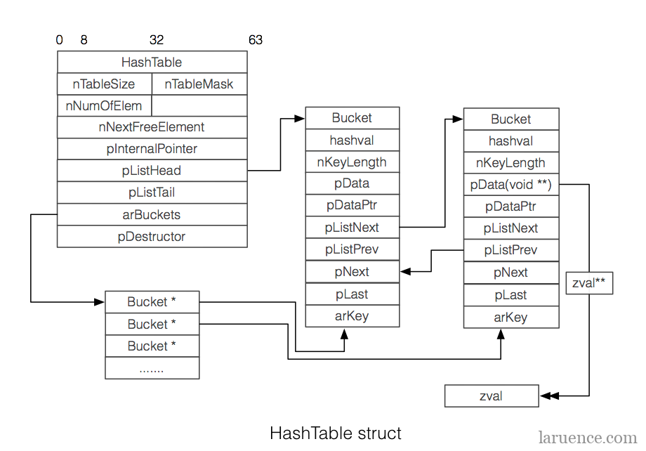
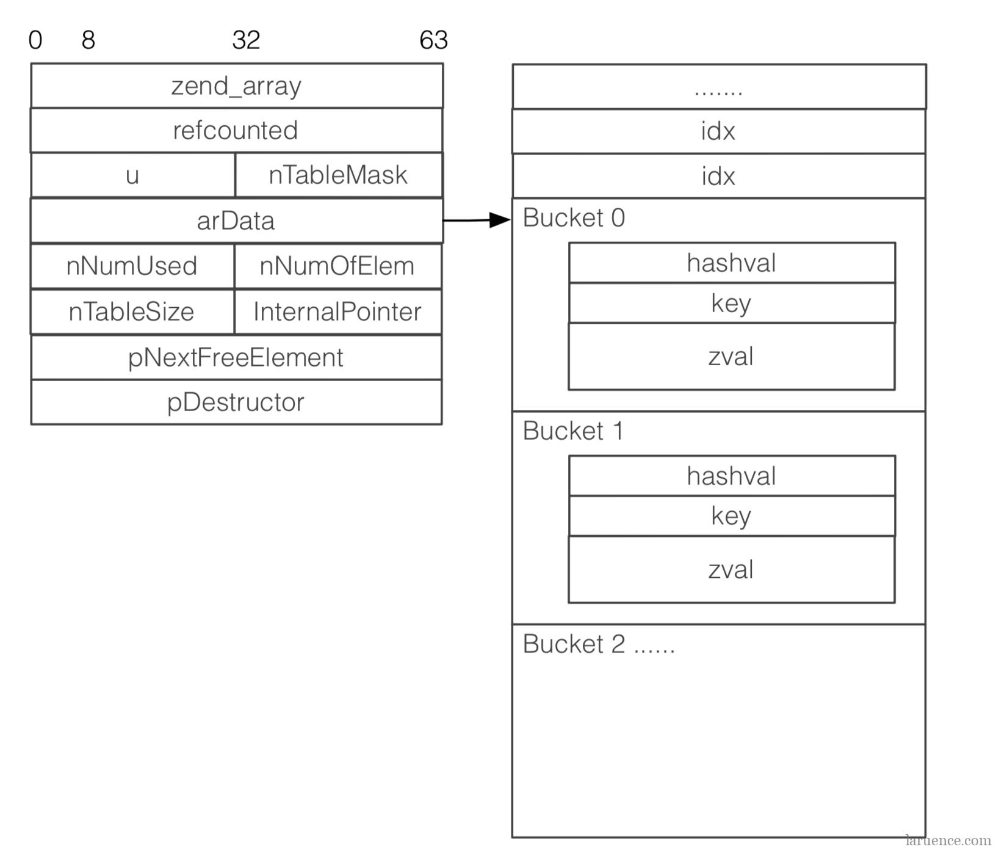

# PHP foreach

遍历过程需解决 **array/object** 被修改导致的 **悬挂指针** \(dangling pointer\) 问题。

PHP5 和 PHP7在这方面有很大不同。总结是，PHP5 使用 **IAP** 、**HashPointer** 的方法，导致各种奇怪的极端情况问题，而PHP7 的方法更复杂，导致行为的可预测性和一致性更高。

## PHP 5

* 遍历伪代码

Normal way of looping

```php
reset(arr);
while (get_current_data(arr, &data) == SUCCESS) {
    code();
    move_forward(arr);
}
```

PHP5

```php
reset(arr);
while (get_current_data(arr, &data) == SUCCESS) {
    move_forward(arr);
    code();
}
```

* 内部数组指针（Internal array pointer） 和 哈希指针（Hash Pointer）

  **IAP** 对应 PHP5 **HashTable** 中的 **pInternalPointer**，用以表示数组当前的遍历元素的位置，每当删除元素时，都会检查 IAP 是否指向该元素。如果是这样，它将前进到下一个元素。



**哈希指针** 在循环主体之前将指向当前元素的指针以及 **hash** 值备份到 每个 foreach 的 **Hash Pointer**中。在循环主体之后，如果 **IAP** 仍存在，则将 **IAP** 设置回该元素，如果该元素已删除，将仅使用 **IAP** 当前所在的位置进而解决了只有一个 **IAP** 支持多层遍历的问题。

* 数组复制
  * 数组不是引用
  * refcount &gt; 1

    例如：

```php
<?php
function iterate($arr) {
    foreach ($arr as $v) { // refcount = 2 }
}

$outerArr = [0, 1, 2, 3, 4];
iterate($outerArr);
var_dump(current($outerArr)); // 0
```

数组的 `refcount` 在 `iterate` 函数中为 2

```php
$foo = $array = [1, 2, 3, 4, 5];
foreach ($array as $val) { // refcount 为 2
    var_dump(current($array)); //1 1 1 1 1
}
```

## PHP7

zend\_array 组织图：



zend\_array 定义：

```c
struct _zend_array {
    zend_refcounted_h gc;
    union {
        struct {
            ZEND_ENDIAN_LOHI_4(
                zend_uchar    flags,
                zend_uchar    _unused,
                zend_uchar    nIteratorsCount,
                zend_uchar    _unused2)
        } v;
        uint32_t flags;
    } u;
    uint32_t          nTableMask;
    Bucket           *arData;
    uint32_t          nNumUsed;
    uint32_t          nNumOfElements;
    uint32_t          nTableSize;
    uint32_t          nInternalPointer;
    zend_long         nNextFreeElement;
    dtor_func_t       pDestructor;
};
```

* 数组复制 取决于 **COW**
* HashTable 遍历

直接遍历 `arData`

```php
$array = [1, 2, 3, 4, 5];
$ref = &$array;
foreach ($array as $val) {
    var_dump($val);
    $array[2] = 0;
}
/* Old output: 1, 2, 0, 4, 5 */
/* New output: 1, 2, 3, 4, 5 */
```

PHP5 时因 `$array` 为引用会导致 `$array[2]` 修改，PHP7 按值迭代时将始终会对原数组遍历。

```php
$array = [1, 2, 3, 4, 5];
$ref = &$array;
foreach ($array as &$val) {
    var_dump($val);
    $array[2] = 0;
}
/* Old output: 1, 2, 0, 4, 5 */
/* New output: 1, 2, 0, 4, 5 */
```

**总结** PHP7 只需考虑按值遍历还是引用遍历，如果是使用值遍历始终为原数组，引用遍历则会改变原数组；foreach 过程无作用域导致需要手动 unset\($value\)，否则会有各种 unexpected 问题。

## 遍历数组未使用 unset\($value\) 后产生不可预期的结果

```php
<?php
$var = [1, 2];
foreach ($var as &$value) {
}

debug_zval_dump($var);
// array(2) refcount(2){
//     [0]=>
//     int(1)
//     [1]=>
//     &int(2)
//   }
processData($var);
debug_zval_dump($var);
// array(2) refcount(2){
//     [0]=>
//     int(1)
//     [1]=>
//     &int(3)
//   }

function processData($data)
{
    debug_zval_dump($data);
    // array(2) refcount(3){
    //     [0]=>
    //     int(1)
    //     [1]=>
    //     &int(2)
    //   }
    foreach ($data as $key => $value) {
        $data[$key] = 3;
    }
    debug_zval_dump($data);
    // array(2) refcount(2){
    //     [0]=>
    //     int(3)
    //     [1]=>
    //     &int(3)
    //   }
}
```

**疑问：**

* 为什么  `foreach($array ash &item)` 之后只有最后一个元素为引用类型？

  其实通过 xdebug\_debug\_zval 可以看到，数组除最后一个元素之外的其他元素为 refcount = 1; is\_ref = 1。但在判断是否为引为的逻辑应该为 is\_ref = 1 && refcount &gt; 1，所以在 $data\[$key\] 对数组最后一项进行修改时会同时修改 $var 的最后一项。

  PHP manual 关于 refcount 和 is\_ref 的解释：[link](https://www.php.net/manual/en/features.gc.refcounting-basics.php)

  > Note that if "refcount" is 1, "is\_ref" is always FALSE.

